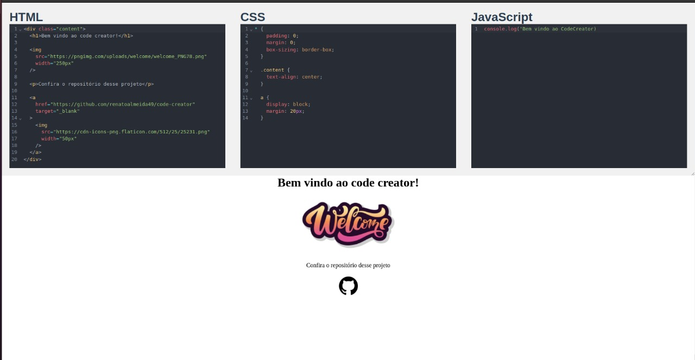

# code creator

Um clone da ideia básica do CodePen. Aqui você pode testar códigos HTML, aplicar o CSS e testar o JavaScript.

* Escreva seu código
* Veja o resultado em tempo real

## :clipboard: Sumário

- [Visão Geral](#visao-geral)
  - [O problema](#o-problema)
  - [Prints](#prints)
  - [Links](#links)
- [Meu processo](#meu-processo)
  - [Construção](#construcao)
  - [O que aprendi](#o-que-aprendi)
- [Futuras implementações](#futuras-implementacoes)
- [Como executar o projeto](#como-executar-o-projeto)
- [Autor](#autor)

## :telescope: Visão geral

### O problema

A funcionalidade do CodePen sempre chamou minha atenção. E me intrigava como ele era feito.

Descobri que a aplicação funcionava utilizando a tag HTML ```<iframe>``` . Uma tag que lembro de ter visto no começo do curso quando estudei HTML, mas não havia entendido exatamente o que era, nem para que servia, e muito menos o seu potencial.
  
### Prints  
  

    
### Links
 
- Projeto online: [Netlify](https://startling-bunny-c4a424.netlify.app/)  
  
## :pencil2: Meu processo 
  
### Construção  
  
- Frontend:  
  - VueJs 
  - VueCodemirror

### O que aprendi

O uso do ```<iframe>``` é muito vasto e é uma ferramenta muito poderosa. A implementação dela é vasta e cabe muitas possibilidades e usos.

Para a criação do JavaScript no iframe, o Vue não permite um template string com uma tag script. Essa proteção do Vue fez com que o trabalho fosse um pouco mais complicado para a geração do script do iframe.

O contorno foi feito criando uma tag script programáticamente e passando o conteúdo dela também de forma programática.

Mais uma vez pude entender como é possível construir muitas soluções utilizando conhecimento relativamente simples de HTML, CSS e Javascript.
  

## :satellite: Futuras implementações
  
:white_medium_square: Versão mobile  
:white_medium_square: Opção para alternar editores para exibição vertical  
:white_medium_square: Reposicionar o botão de redimensionamento dos editores  
:white_medium_square: Opção de download do código criado
 

## :arrow_forward: Como executar o projeto

Certifique-se de ter instalado o NodeJs em sua máquina. Você pode digitar no seu terminal o comando: 
```
node -v
```
Após realizar o clone do repositório, navegue até a pasta raiz do proejto e no terminal execute o comando abaixo para as dependências serem instaladas:

```
npm install

// ou usando yarn:

yarn
```
  
Com as dependências instaladas execute o comando seguinte para executar o projeto:
```
npm run serve

// ou usando yarn

yarn serve
```
  
## :smile: Autor  
  
- Renato Novaes
  - [Linkedin](https://www.linkedin.com/in/renatonovaes49)
  - [Instagram](https://www.instagram.com/novaes_r)

## :clap: Agradecimentos  
  
* **Rafael Rodrigues** - [Linkedin](https://www.linkedin.com/in/r-a-f-a-e-l-rodrigues/) - Mestre na arte de ensino. Sempre aprendo algo novo com ele.
* **Thiago Vilasboas** - [Linkedin](https://www.linkedin.com/in/thiago-vilasboas/) - O cara que mais entende de CSS que eu conheço
